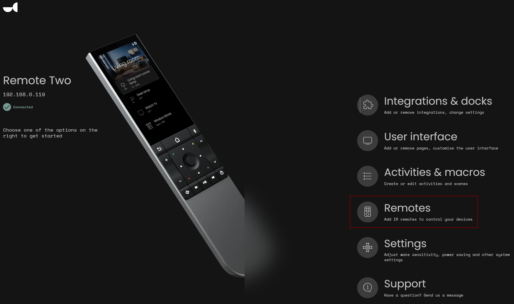
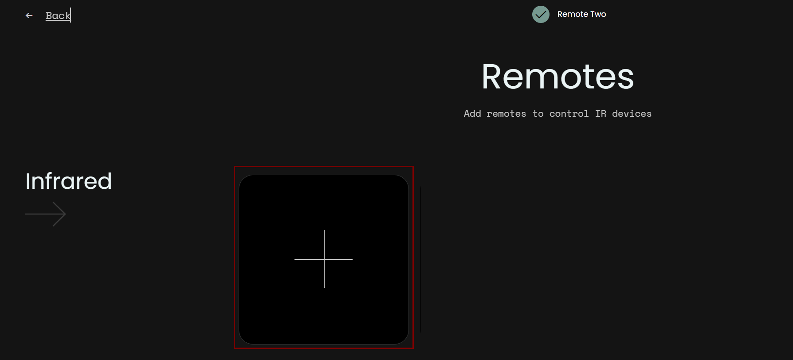
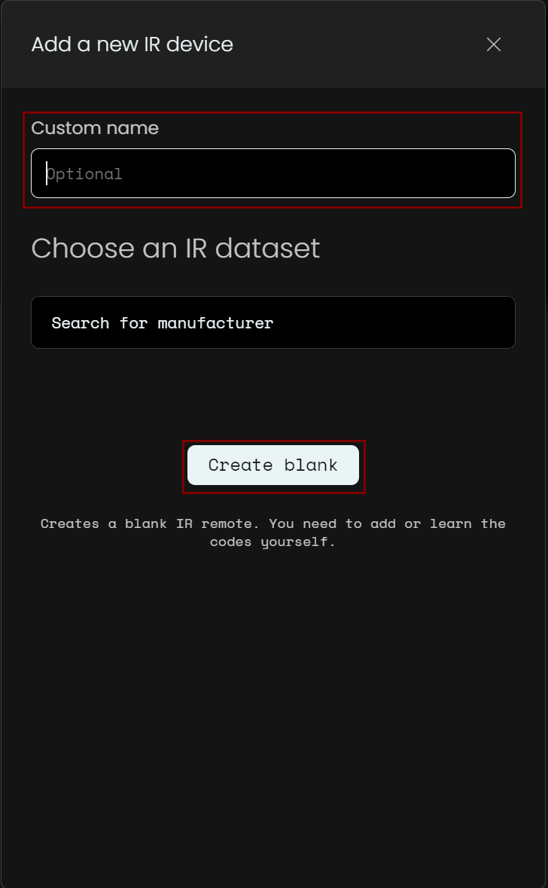
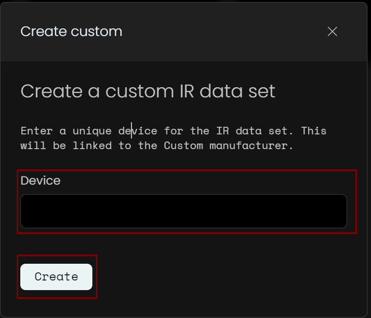
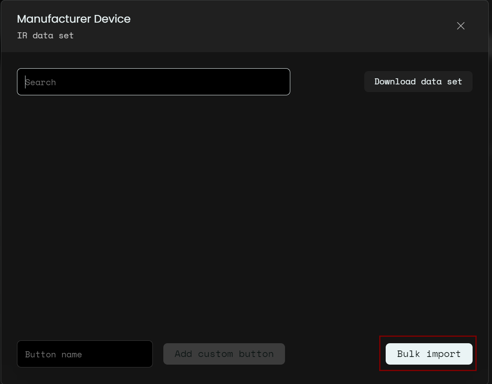
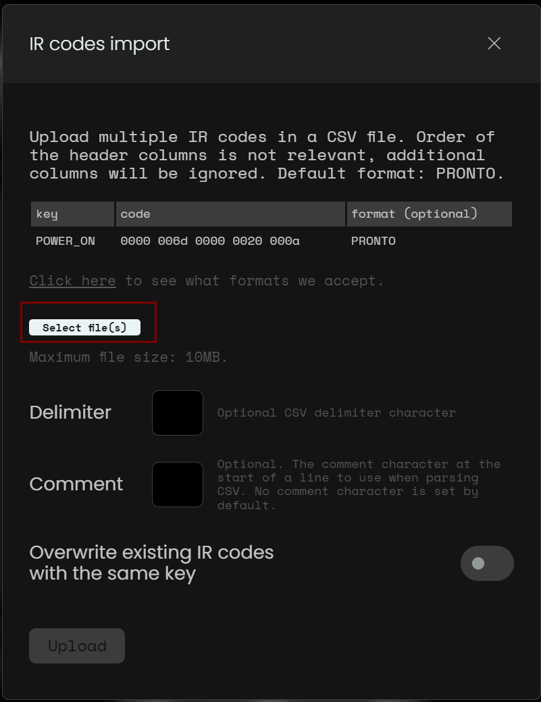

# unfoldedcircle-ircodes
A collection of IR codesets for the Unfolded Circle Remote Two

The purpose of the repository is to collect custom IR codesets for the Unfolded Circle Remote Two. If you've created a custom codeset because the included ones don't work for you, feel free to send a pull request to share your codeset with the community.

## Getting started

Open the **remotes section** in the configurator UI.

Click on the **add** button on the remotes section.

Give the remote a name and click on **Create Blank**.

Give the device a descriptive name (manufacturer and model) and click on **Create**.

Click on the edit button next to the dataset name

![Remote editor (./assets/remote_editor_screen.png)

Click on **Bulk Import**

Click on **Select file** and adjust the delimiter if needed.
Click on **Upload** in order to complete the import.

