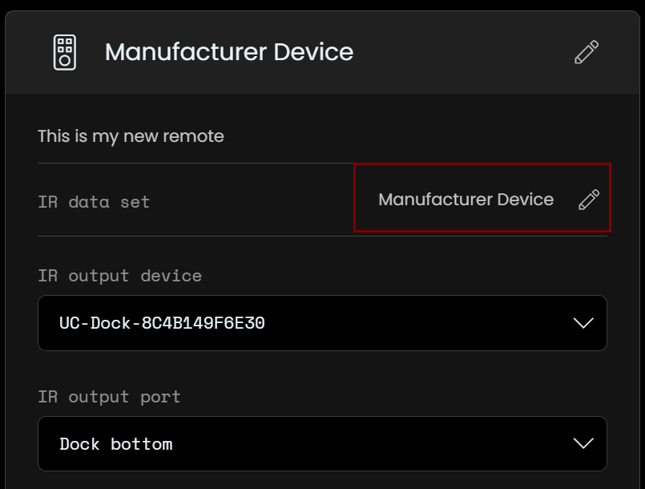
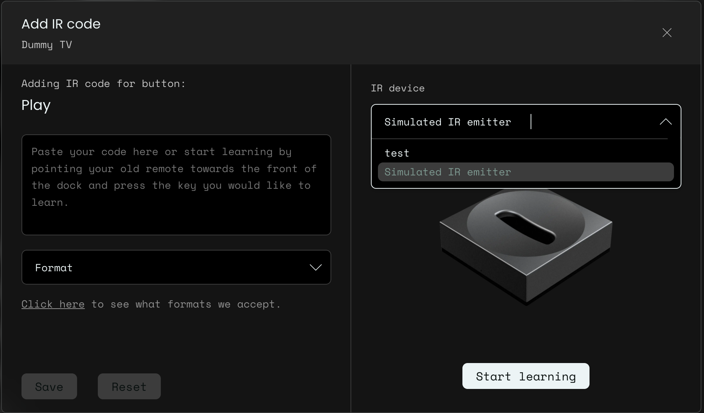
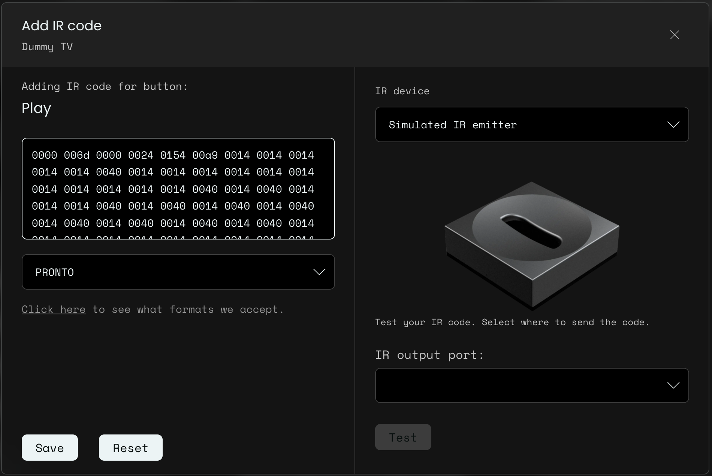

# unfoldedcircle-ircodes

A collection of IR codesets for the Unfolded Circle Remote Two

The purpose of the repository is to collect custom IR codesets for the Unfolded Circle Remote Two. Follow the steps in [Use custom codesets](#use-custom-codesets) to learn how to use a custom codeset from this repository with your remote.

If you've [created a custom codeset](#create-a-custom-codeset) because the included ones don't work for you, feel free to send a pull request to share your codeset with the community.

## Use custom codesets

Open the **remotes section** in the configurator UI.

Click on the **add** button on the remotes section.

Give the remote a name (e.g. "My Sony Amp") and click on **Create Blank**.

Give the device a descriptive name (manufacturer and model, e.g. "Sony STR DN1080") and click on **Create**.

Click on the edit button next to the dataset name

Click on **Bulk Import**

Click on **Select file** and adjust the delimiter if needed.
Click on **Upload** in order to complete the import.

## Create a custom codeset

Open the **remotes section** in the configurator UI.

Click on the **add** button on the remotes section.

Give the remote a name (e.g. "My TV") and click on **Create Blank**.

Give the device a descriptive name (manufacturer and model, e.g. "Dummy TV") and click on **Create**.

At the buttom of the screen, name the button you want to program (e.g. "Play") and click on **Add custom button**.

Follow the instructions on the next screen: Either directly enter the IR code and save or click on **Start learning**, point your device's original remote to the IR emitter and press the button you want to learn. Once the code has been registered you can test the new code and the click on **Save** to close.

Repeat the previous step for each button you want to program.

To export the codeset as a CSV file click on the **Download data set** button. If you want share your new codeset please submit the CSV file in a pull request to this repository.
